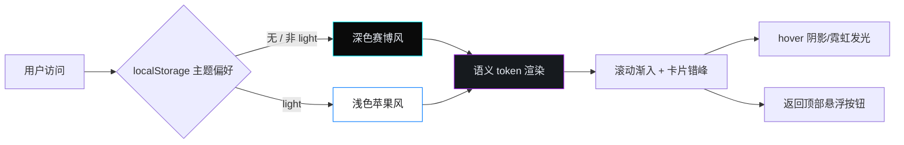
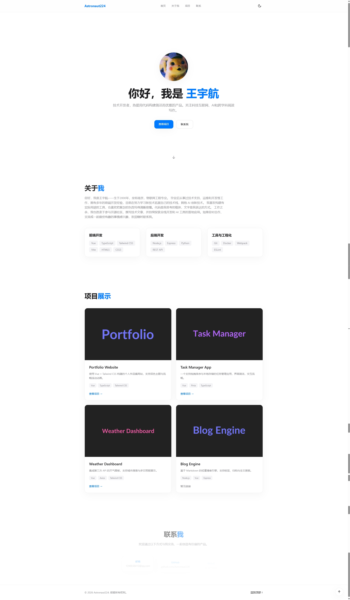
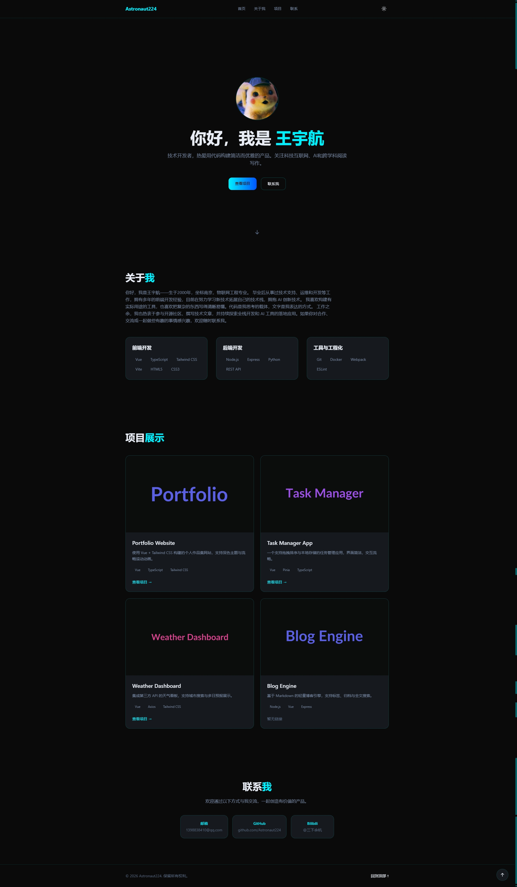

# 🛰️ 个人作品集 Portfolio


一个使用 Vue 3 + TypeScript + Tailwind CSS v4 构建的**单页个人作品集网站**，主打「极简苹果风」与「未来赛博风」双主题切换体验。默认深色，支持一键切换并通过 localStorage 记忆用户偏好，配合卡片级渐入动画与霓虹交互发光，让简历型站点也能有质感。

## ✨ 特性

- 🎨 **双主题感官**：浅色极简苹果风（纯白 + 纯蓝 #007AFF + 毛玻璃卡片）/ 深色未来赛博风（深空黑 + 电光青 #00F0FF + 霓虹紫点缀 + 发光阴影）。
- 🌗 **默认深色 + 记忆切换**：`<html>` 上以 `.dark` 类驱动，index.html 内联脚本在 Vue 挂载前同步应用偏好，避免首帧主题闪烁（FOUC）。
- 🧩 **语义化设计 token**：所有颜色与阴影在 `src/style.css` 中以 `@theme`（浅色默认）+ `.dark` 覆盖统一管理，组件只消费语义变量，换肤不改业务代码。
- 💫 **滚动渐入与卡片错峰动画**：基于 `IntersectionObserver` 的 `useScrollAnimation`，模块淡入上移、卡片按 `--reveal-delay` 错峰渐入，并尊重 `prefers-reduced-motion`。
- 🖱️ **交互细节**：卡片 hover 仅加深阴影/发光而不平移，关键按钮深色下带霓虹光晕；滚动超阈值后右下角出现「返回顶部」悬浮按钮，回顶后自动隐藏。
- 🖼️ **懒加载与响应式**：头像与项目截图均 `loading="lazy"`，移动端汉堡菜单 + 自适应栅格。
- 🔗 **数据驱动**：项目、技能列表抽离到 `src/data/*.ts`，便于后续增改。

## 📸 预览







## 🎨 主题设计

| 维度 | 浅色·极简苹果风 | 深色·未来赛博风 |
| --- | --- | --- |
| 背景 | 纯白 #FFFFFF / 浅灰 #F5F5F7 | 深空黑 #0A0A0A / 深灰蓝 #0B0E14 |
| 主色 | 纯蓝 #007AFF | 电光青 #00F0FF |
| 点缀 | 系统灰 #8E8E93 | 霓虹紫 #B026FF |
| 品牌字 | 纯蓝实色（无渐变） | 青→蓝渐变 |
| 卡片 | 毛玻璃 + 极淡边框 rgba(0,0,0,.06) | 青色描边 + 发光阴影 |
| 滚动条 | 系统默认灰 | 深底亮青滑块 |

主题切换对所有颜色/阴影加 `0.3s ease` 过渡，丝滑无闪烁。

## 🛠️ 技术栈

- Vue 3.5（Composition API + `<script setup>`）
- TypeScript 5.6
- Vite 6（开发与构建）
- Tailwind CSS v4（`@tailwindcss/vite` + `@theme` 语义 token）

## 📁 项目结构

```text
src/
├─ components/      逻辑分区的页面组件
│  ├─ AppHeader.vue      顶部导航 + 主题切换按钮
│  ├─ Hero.vue           首页大标题 + 简介 + 头像
│  ├─ About.vue          关于我 + 技能分组
│  ├─ Projects.vue       项目卡片列表
│  ├─ Contact.vue        联系方式卡片
│  ├─ AppFooter.vue      页脚
│  └─ BackToTop.vue      返回顶部悬浮按钮
├─ composables/
│  ├─ useTheme.ts        主题持久化与切换
│  └─ useScrollAnimation.ts  IntersectionObserver 滚动渐入
├─ data/
│  ├─ projects.ts         项目数据（数组化，便于增改）
│  └─ skills.ts          技能分组数据
├─ style.css        全局样式 + 语义 token + 工具类
├─ App.vue          页面骨架
└─ main.ts          入口（先 applyStoredTheme 再挂载）
```

## 🚀 快速上手

### 环境要求

- Node.js >= 18
- npm >= 9（或 pnpm / yarn 等效包管理器）

### 安装与运行

```bash
git clone https://github.com/Astronaut224/portfolio.git
cd portfolio
npm install
npm run dev
```

启动后访问终端提示的本地地址（默认 `http://localhost:5173/`）即可。

### 构建与类型检查

```bash
npm run build        # vue-tsc 类型检查 + vite 生产构建，输出到 dist/
npm run typecheck    # 仅运行 vue-tsc 类型检查
npm run preview      # 预览生产构建产物
```

## 📄 许可证

本项目基于 [GNU General Public License v3.0](./LICENSE) 开源。